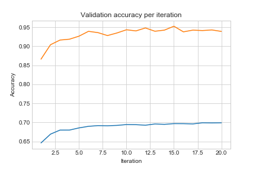

# **Traffic Sign Recognition** 

## Writeup

**Build a Traffic Sign Recognition Project**

The goals / steps of this project are the following:
* Load the data set (see below for links to the project data set)
* Explore, summarize and visualize the data set
* Design, train and test a model architecture
* Use the model to make predictions on new images
* Analyze the softmax probabilities of the new images
* Summarize the results with a written report

## Rubric Points
### Here I will consider the [rubric points](https://review.udacity.com/#!/rubrics/481/view) individually and describe how I addressed each point in my implementation.  

---
### README

#### 1. Provide a Writeup / README that includes all the rubric points and how you addressed each one. You can submit your writeup as markdown or pdf. You can use this template as a guide for writing the report. The submission includes the project code.

You're reading it! and here is a link to my [project code](https://github.com/wangjubo/Udacity/blob/origin/develop/SelfDrivingCarNanoDegree/CarND-Traffic-Sign-Classifier-Project/Traffic_Sign_Classifier.ipynb)

### Data Set Summary & Exploration

#### 1. Provide a basic summary of the data set. In the code, the analysis should be done using python, numpy and/or pandas methods rather than hardcoding results manually.

I used the pandas library to calculate summary statistics of the traffic
signs data set:

* The size of training set is 34799
* The size of the validation set is 4410
* The size of test set is 12630
* The shape of a traffic sign image is (32, 32, 3)
* The number of unique classes/labels in the data set is 43

#### 2. Include an exploratory visualization of the dataset.

Here is an exploratory visualization of the data set. It is a bar chart showing how the data. I see lots of the images being quite dark, meaning the CNN that I'm gonna build should be able to overcome this challenge.

### Design and Test a Model Architecture

#### 1. Describe how you preprocessed the image data. What techniques were chosen and why did you choose these techniques? Consider including images showing the output of each preprocessing technique. Pre-processing refers to techniques such as converting to grayscale, normalization, etc. (OPTIONAL: As described in the "Stand Out Suggestions" part of the rubric, if you generated additional data for training, describe why you decided to generate additional data, how you generated the data, and provide example images of the additional data. Then describe the characteristics of the augmented training set like number of images in the set, number of images for each class, etc.)

As a first step, I decided to convert the images to grayscale because this reduces data process load, while should not significantly reduce accuracy. I've seen papers saying gray scaling will reduce accuracy. So in a real-world implementation I would consider this step as optional.

Secondly, I scaled the image from 0-255 to zero mean and unit variance, to reduce impact of original image's scale to training. E.g. if original image has very bright light (all pixels are scaled towards 255), this step should normalize that to a normal scale range, make the information richer.

Here is an example of a traffic sign image from original to after grayscaling, then after normalization.

#### 2. Describe what your final model architecture looks like including model type, layers, layer sizes, connectivity, etc.) Consider including a diagram and/or table describing the final model.

My final model consisted of the following 18 layers:

| Layer         		|     Description	        					| 
|:---------------------:|:---------------------------------------------:| 
| Input         		| 32x32x3 RGB image   							| 
| Preprocess      		| 32x32x1 zero-mean zero variance image 		| 
| Convolution 5x5     	| 1x1 stride, valid padding, outputs 28x28x6 	|
| RELU					|												|
| Max pooling	      	| 2x2 stride,  outputs 14x14x6   				|
| Convolution 5x5     	| 1x1 stride, valid padding, outputs 10x10x16 	|
| RELU					|												|
| Max pooling	      	| 2x2 stride,  outputs 5x5x16   				|
| Flatten       		| outputs 400 									|
| Fully connected		| outputs 120 									|
| RELU					|												|
| Dropout				| 0.5 keep probability							|
| Fully connected		| outputs 84 									|
| RELU					|												|
| Dropout				| 0.5 keep probability							|
| Fully connected		| outputs 43 									|
| RELU					|												|
| Softmax				|           									|

#### 3. Describe how you trained your model. The discussion can include the type of optimizer, the batch size, number of epochs and any hyperparameters such as learning rate.

To train the model, I used an Adam Optimizer, the batch size is 32. I typically trained 10-20 epochs to reach a steady validation accuracy. I played with learning rate, and found 0.0008 is a good balance between over aggressive model adjustment, and too slow model change.

#### 4. Describe the approach taken for finding a solution and getting the validation set accuracy to be at least 0.93. Include in the discussion the results on the training, validation and test sets and where in the code these were calculated. Your approach may have been an iterative process, in which case, outline the steps you took to get to the final solution and why you chose those steps. Perhaps your solution involved an already well known implementation or architecture. In this case, discuss why you think the architecture is suitable for the current problem.

My final model results were:
* training set accuracy of 0.997
* validation set accuracy of 0.944
* test set accuracy of 0.926

If an iterative approach was chosen:
* What was the first architecture that was tried and why was it chosen?
It took me a long way to get 0.93. I started with a plain LENET CNN, I only got about 0.91 accuracy. 

* What were some problems with the initial architecture?
There're many possible problems, including number of layers not enough to capture the rich information for this problem, and many possible optimization techniques not used.

* How was the architecture adjusted and why was it adjusted? Typical adjustments could include choosing a different model architecture, adding or taking away layers (pooling, dropout, convolution, etc), using an activation function or changing the activation function. One common justification for adjusting an architecture would be due to overfitting or underfitting. A high accuracy on the training set but low accuracy on the validation set indicates over fitting; a low accuracy on both sets indicates under fitting.
I tried adding more fully connected layers, and add more nodes into existing layers, but didn't increase accuracy much, only to something around 0.92-0.93.

I noticed the training accuracy almost reached 0.99, while validation accuracy is still low, it means it's overfit.

Then, I also added the dropout layer to reduce overfit, with 0.8 keep rate, still, not consistently getting >0.93 accuracy.

Finally, I found the trick is to add dropout layers with 0.5 keep rate, then I can consistently get >0.94 validation accuracy. Basically, the problem was still overfitting.

* Which parameters were tuned? How were they adjusted and why?
Number of nodes in each convolution layer, in fully connected layers, and dropout rate. The former 2, the more the better for accuracy, but longer training time; the later one (dropout rate) needs to hit a balance between overfit and underfit.

* What are some of the important design choices and why were they chosen? For example, why might a convolution layer work well with this problem? How might a dropout layer help with creating a successful model?
Convolution layer work well because the nature of the problem is that each pixel of image is highly correlated to adjacent pixels with information contained. Convolution layer can represent this information regardless of where it appears in the image.

Dropout is an important part of this model, reduce the overfit problem for training data, by building up redundancy in the network.

If a well known architecture was chosen:
* What architecture was chosen?
LENET

* Why did you believe it would be relevant to the traffic sign application?
Original handwriting problem and this one are both static image recognition problem with very limited classes of possibilities.

* How does the final model's accuracy on the training, validation and test set provide evidence that the model is working well?
As long as training accuracy is not too much higher than validation accuracy, and validation accuracy is not too much higher than test accuracy, it means the model didn't over fit to training, nor it overfit to validation data. 
 

### Test a Model on New Images

#### 1. Choose five German traffic signs found on the web and provide them in the report. For each image, discuss what quality or qualities might be difficult to classify.

Here are five German traffic signs that I found on the web:

    

The 2nd image might be difficult to classify because the contrast in the image is not very high, when converted to grey, this contract maybe even lower.

#### 2. Discuss the model's predictions on these new traffic signs and compare the results to predicting on the test set. At a minimum, discuss what the predictions were, the accuracy on these new predictions, and compare the accuracy to the accuracy on the test set (OPTIONAL: Discuss the results in more detail as described in the "Stand Out Suggestions" part of the rubric).

Here are the results of the prediction:

| Image			        |     Prediction	        					| 
|:---------------------:|:---------------------------------------------:| 
| Speed limit (70km/h)  | Speed limit (70km/h)							| 
| Speed limit (80km/h)	| Speed limit (50km/h)  						|
| No passing			| No passing									|
| No entry	      		| No entry	    				 				|
| Priority road			| Priority road      							|

The model was able to correctly guess 4 of the 5 traffic signs, which gives an accuracy of 80%. This compares favorably to the accuracy on the test set of 92% accuracy.

#### 3. Describe how certain the model is when predicting on each of the five new images by looking at the softmax probabilities for each prediction. Provide the top 5 softmax probabilities for each image along with the sign type of each probability. (OPTIONAL: as described in the "Stand Out Suggestions" part of the rubric, visualizations can also be provided such as bar charts)

The code for making predictions on my final model is located in the 11th cell of the Ipython notebook.

For the first image, the model is very sure that this is a stop sign (probability of 0.99). So no need to analyze other possibilities in this writeup.

| Probability         	|     Prediction	        					| 
|:---------------------:|:---------------------------------------------:| 
| .999         			| Speed limit (70km/h)  						| 

For the second image, the model is somehow over too confident regarding 8 as 5. Intuitively, the shape look similar, but it means if I put in more specific training samples for 80 and 50 speed limit signs, this problem should get resolved.

| Probability         	|     Prediction	        					| 
|:---------------------:|:---------------------------------------------:| 
| .989         			| Speed limit (50km/h)  						| 

The rest 3 all have very certain outputs.

How to reduce the high certainty of all these images? That's an open question.

### (Optional) Visualizing the Neural Network (See Step 4 of the Ipython notebook for more details)
#### 1. Discuss the visual output of your trained network's feature maps. What characteristics did the neural network use to make classifications?

From the layer 1 of the trained model, we can see different feature maps seem to cast shadow from different directions. Some has edge detector like outcome. However, I cannot directly tell why these feature maps are chosen, compared to the randomly initialized model value.

##### Layer 1 with trained model (Convolutional. Input = 32x32x1. Output = 28x28x6.)

##### Layer 1 with randomly initialized model (Convolutional. Input = 32x32x1. Output = 28x28x6.)

